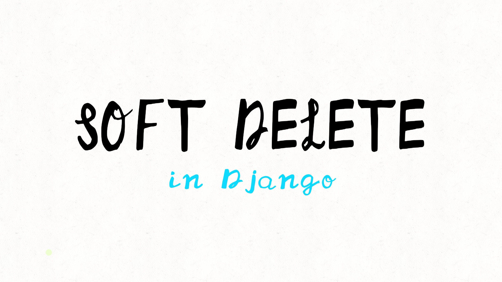

## Soft Delete in django 

## Implementing Soft Delete in Django (Including Cascade Relations)

Once more I searched a lot and didn’t find an appropriate and complete solution for soft delete, especially with cascade relation.
>  *I will explain my solution it could be imperfect.*

## What is Soft Delete:

So when you have some data in your database and you don’t want to completely delete it from the database and want to keep it, you have to use soft delete. It doesn’t delete the data; it just marks the data as deleted and limits the normal queries from accessing all of the data.

### When to use Soft Delete:

Soft delete is useful for recovering data and preventing accidental loss of important data. Many companies use soft delete because it is important to have users’ information.

### Examples of Soft Delete:

An obvious example is the recycle bin in Windows and the bin in MacOS. You delete the app, file, etc., but you can recover it.

Some social media platforms have temporary account deletion or disabling accounts. For example, in Instagram, there is an option to disable your account; after that, your account doesn’t count as an active account.

It happens in Messengers too. When you delete a message, it remains on the server for a certain time (1 month or 6 months). By contacting the support team, you can recover the message.
>  **Enough talking**

## Implementing the soft delete:

Start an app called common and open the models.py

    uv run manage.py startapp commen 
    # if you didn't setup uv use the traditional
    python manage.py startapp commen 

Import the dependencies:

    from django.db import models
    from django.db.models import Manager
    from django.utils.timezone import now

### We have to make 3 main parts:

 1. Custom Model

 2. Custom Manager

 3. Custom Queryset

We have to create an abstract base model to inherit in other models, so add SoftDeleteModel that inherits from models.Model

    class SoftDeleteModel(models.Model):
        """An Abstract model for soft delete"""
        is_deleted = models.BooleanField(default=False)
        deleted_at = models.DateTimeField(blank=True, null=True)

We use two parameters: is_deleted, which is the flag that we use in the query filter and shows the availability of a record, and deleted_at. So why do I use this parameter? Maybe later on we want to hard delete the record via a cron job or Celery-beat; it depends on you. Don't write this one if you won't use an automated job to delete them.

Anyway, Let’s move on..

    class SoftDeleteModel(models.Model):
        """An Abstract model for soft delete"""
        is_deleted = models.BooleanField(default=False)
        deleted_at = models.DateTimeField(blank=True, null=True)
    
        objects_default = Manager()
        objects = SoftDeleteManager()

We need to write two managers: first to handle the default manager with a default queryset, and a second manager with a custom queryset.

    class SoftDeleteManager(Manager):
        """Custom manager for soft delete."""
        def get_queryset(self):
            """Rewrite the default get queryset method."""
            return SoftDeleteQuerySet(self.model, using=self._db).active()
    
        def get_all(self):
            """Method to get all data."""
            return SoftDeleteQuerySet(self.model, using=self._db)
    
        def deleted_only(self):
            """Method to get just deleted data."""
            return SoftDeleteQuerySet(self.model, using=self._db).deleted()

Create a custom manager, rewrite the get_queryset, and add two custom methods.

### Let’s build the queryset to understand the manager.

    class SoftDeleteQuerySet(models.QuerySet):
        """Custom queryset for Soft delete."""
    
        def _soft_delete(self):
            """Write a soft delete method."""
            return self.update(is_deleted=True, deleted_at=now())
    
        def delete(self):
            """Rewrite the default delete method."""
            return self._soft_delete()
    
        def hard_delete(self):
            """Hard delete method to use the default delete method."""
            return super().delete()
    
        def restore(self):
            """Restore method to restore data."""
            return self.update(is_deleted=False, deleted_at=None)
    
        def deleted(self):
            """Method for filter the deleted data."""
            return self.filter(is_deleted=True)
    
        def active(self):
            """Method for filter the data which is not deleted."""
            return self.filter(is_deleted=False)

Here, I rewrote the default bulk delete to a soft bulk delete, updating the is_deleted and deleted_at parameters.

Instead of using the straightforward bulk delete, I wrote it as hard_delete. Deleted and active methods are to filter the query.
>  Let’s move on

    class SoftDeleteModel(models.Model):
        """An Abstract model for soft delete"""
        is_deleted = models.BooleanField(default=False,de_index=True)
        deleted_at = models.DateTimeField(blank=True, null=True)
    
        objects_default = Manager()
        objects = SoftDeleteManager()
    
        class Meta:
            abstract = True
    
        def _soft_delete(self):
            """Soft delete method to delete the record and related records too."""
            if self.is_deleted is True:
                return
            self.is_deleted = True
            self.deleted_at = now()
            self.save()
            for related in self._meta.related_objects:
                if related.on_delete == models.CASCADE:
                    related_name = related.get_accessor_name()
                    related_manager = getattr(self, related_name, None)
                    if related_manager and hasattr(related_manager, "all"):
                        related_queryset = related_manager.all()
                        related_model = related_queryset.model
                        if issubclass(related_model, SoftDeleteModel):
                            related_manager.all().update(is_deleted=True, deleted_at=now())
    
        def delete(self):
            """Rewrite the default delete method."""
            return self._soft_delete()
    
        def restore(self):
            """"Restore method to restore the record and related records too."""
            if not self.is_deleted:
                return
            self.is_deleted = False
            self.deleted_at = None
            self.save()
    
            for related in self._meta.related_objects:
                if related.on_delete == models.CASCADE:
                    related_name = related.get_accessor_name()
                    related_manager = getattr(self, related_name, None)
                    if related_manager and hasattr(related_manager, "deleted_only"):
                        related_queryset = related_manager.deleted_only()
                        related_model = related_queryset.model
                        if issubclass(related_model, SoftDeleteModel):
                            related_manager.all().update(is_deleted=False, deleted_at=None)
    
        def hard_delete(self):
            """Hard delete method as default delete"""
            return super().delete()

So the main part, I will explain it step by step.

_soft_delete(self): First of all, it checks that the record hasn't been deleted, and if not, it changes the two parameters to soft delete the record and then saves it. Note that you can use .update() instead of these three lines of code.

After soft deleting the record, we want to soft delete the related records too, so we go through a loop to find the related objects and then go through and find the manager and get the model and then Checks if related objects are also SoftDeleteModel and soft deletes all related records,

delete(self): Rewrite the default delete to soft delete with _soft_delete(self)

restore(self): The restore method works opposite of _soft_delete(self)restore the records and it’s related records instead of .all() uses the .deleted_only() records

_soft_delete(self): Hard delete the records with the default delete method
>  At the end

Conclusion:

Use soft delete when you need it, it is too good to recover data,
 note that this code is not optimized so try to optimize it and make pull requests to improve it,

## 📫 Contact Me

* [LinkedIn](https://www.linkedin.com/in/EhsanShafi3i/)

* [Twitter](https://twitter.com/ehsanshafi3i/)

* [Github](https://github.com/EhsanShafi3i/)

* [Blog](https://ehsanshafi3i.github.io)
